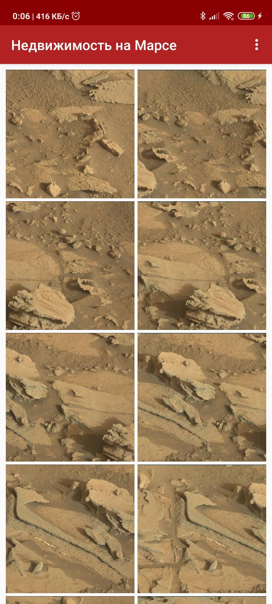
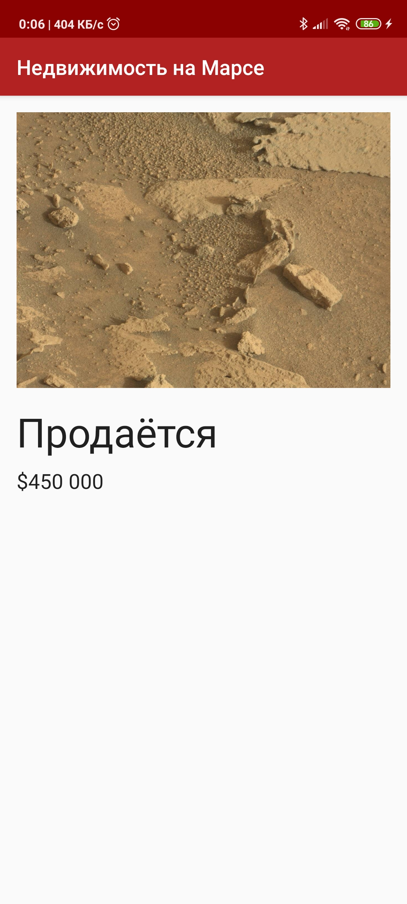
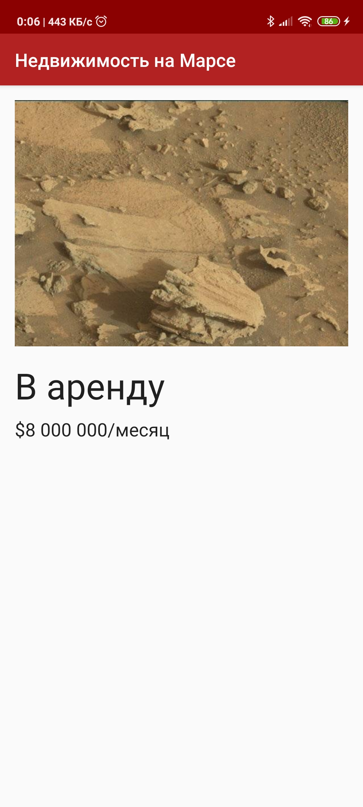

# Connect to the Internet - Mars Real Estate

## MarsRealEstate

MarsRealEstate простое демонстрационное приложение, использующее ViewModel & LiveData, Retrofit, Glide, Moshi и Kotlin.

Это приложение демонстрирует следующие взгляды и методы:

* [Retrofit](https://square.github.io/retrofit/) для выполнения запросов api к веб-службе HTTP
* [Moshi](https://github.com/square/moshi) который обрабатывает десериализацию возвращенного JSON в объекты данных Kotlin
* [Glide](https://bumptech.github.io/glide/) для загрузки и кэширования изображений по URL-адресу.
  
Используются следующие компоненты из библиотеки Jetpack:

* [ViewModel](https://developer.android.com/topic/libraries/architecture/viewmodel)
* [LiveData](https://developer.android.com/topic/libraries/architecture/livedata)
* [Data Binding](https://developer.android.com/topic/libraries/data-binding/) с binding adapters
* [Navigation](https://developer.android.com/topic/libraries/architecture/navigation/) с помощью плагина Safe Args для передачи параметров между фрагментами

## Screenshots

